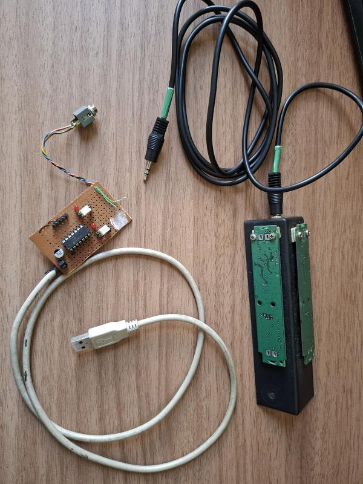
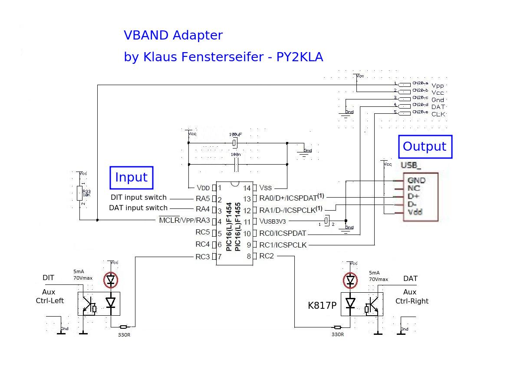
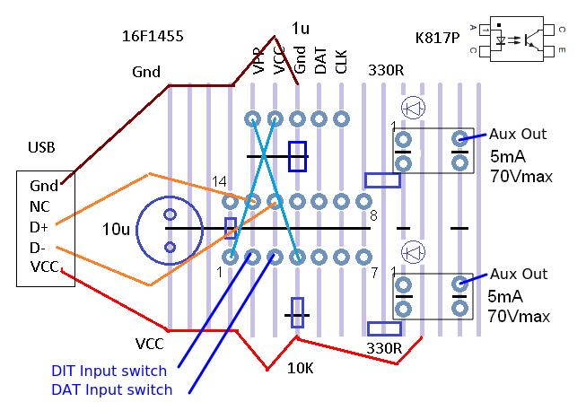
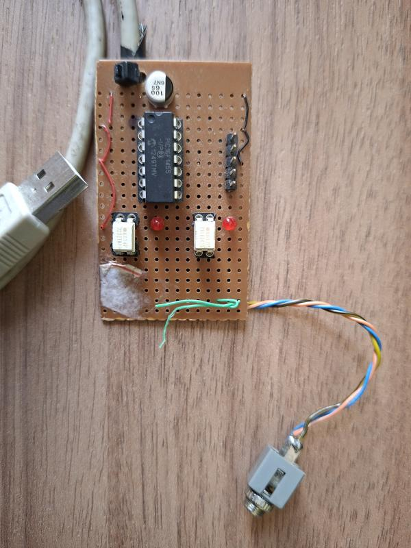
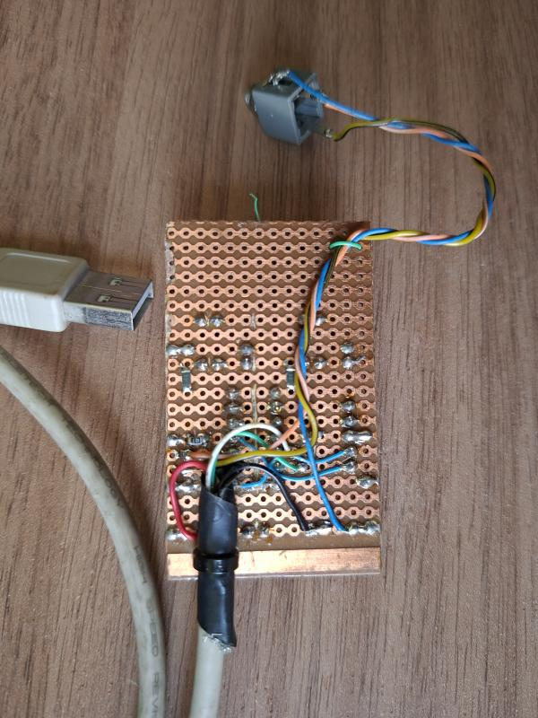
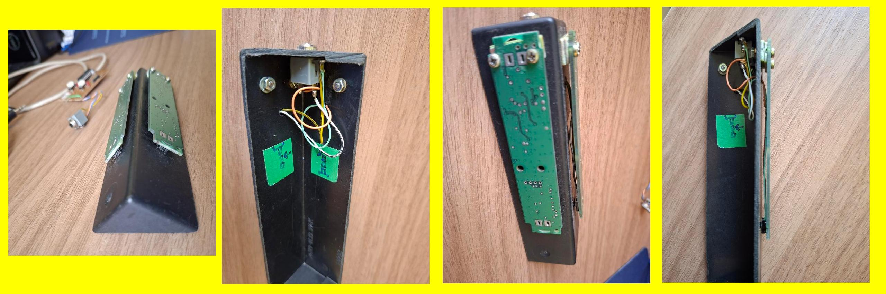

# IamPadUSB - CW Iambic Paddle USB Keyboard Adapter (VBand adapter)
## Left-Ctrl and Right-Ctrl USB HID Keyboard
## by Klaus Fensterseifer - PY2KLA
### (based on Szymon Roslowski code)

 
This project is a USB HID keyboard for PC, using the Microchip PIC16F1455, designed to detect and send only two keys: Left-Ctrl and Right-Ctrl.
It is intended for software or websites that expect these keys for transmitting CW Morse Code DITs and DAHs.
It converts CW iambic paddle switch signals into USB keyboard key presses.
It has a similar function to the VBand Adapter (https://hamradio.solutions/vband/).
 
The original HID code was obtained from the internet a long time ago and I adapted it for my own use. Unfortunately, I could no longer find the original source link.
 
I used the MPLAB X IDE with Microchip XC8 compiler and a PicKit3 programmer to program the PIC16F1455.
 
## Schematic
The power supply is the 5V provided by the USB.
The inputs are the paddle switches, and the output is the USB HID interface. 
I included two LEDs for feedback and debugging purposes. There are also two opto-isolators that I used for another application, but they are not necessary.
 

## PCB Connections

## PCB Top

## PCB Botton

 
## Homemade Iambic Paddle
This picture shows my homemade Iambic Paddle. 
I used a plastic box corner as the base, giving it a triangular shape to reduce horizontal force and improve grip against the table in the downward direction. 
I used pieces of scrap PCB material with a very soft microswitch mounted between the PCB strip and the box. 
The PCB strip keeps the paddle in the released position, while the switch allows a small movement. 
The pictures explain it better.
 

